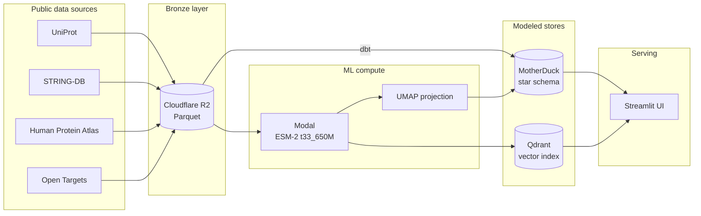

# Protein Atlas

> A living atlas of every human protein — what it does, who it talks to, what goes wrong when it breaks — navigated by an AI that learned biology from sequence alone.

<!-- MAINTAINED: links -->
[Architecture](./ARCHITECTURE.md) · [Roadmap](./ROADMAP.md) · [Setup](./SETUP.md) · **Status**: Part 5 complete — every protein has a plain-English description
<!-- /MAINTAINED -->

<!-- MAINTAINED: hero -->
> Hero screenshot pending — added in Part 6 when the UI lands.
<!-- /MAINTAINED -->

---

## What this is

A multi-source human protein atlas built on a serverless data platform. Every reviewed human protein in UniProt (~20,000 entries) is embedded by Meta's ESM-2 language model, projected to a 2D map, and joined with interactions, tissue data, diseases, and drugs from four other public databases. The result is served through a Streamlit UI that queries the warehouse and vector index directly — no separate API tier.

The same infrastructure that produces the visualization — clusters of kinases, receptors, and transporters in distinct regions of the map — also powers protein-by-protein "story cards" written in plain English: hand-written narratives for the 100 most culturally important proteins, LLM-generated descriptions for the long tail, identical UI for both.

## Why this project exists

The atlas demonstrates end-to-end data engineering on a substantive domain. A reviewer scrolling the project sees:

- **Real multi-source integration**: five public biology databases joined on a single anchor identifier with explicit license tracking and refresh cadences.
- **Modern stack**: serverless GPU inference (Modal), serverless warehouse (MotherDuck), vector database (Qdrant), Infrastructure-as-Code (OpenTofu), asset-based orchestration (Dagster), star-schema modeling (dbt).
- **Production discipline**: idempotent assets, typed Python, CI, no hardcoded secrets, no CSV in pipelines, schema tests on every join.
- **Editorial product sense**: the same UI that demos to a scientist also teaches a curious 12-year-old; the difference between them is a curated-vs-LLM-generated content tier, not a data tier.

## What it does

<!-- MAINTAINED: features -->
- Maps ~20,000 human proteins to a 2D atlas using ESM-2 `t33_650M` embeddings and UMAP.
- Renders a plain-English story card for any protein: what it does, where in the body, who it talks to, what goes wrong when broken, which drugs target it.
- Story-card cross-references are clickable: jump from a protein to its interaction partners or drug targets (e.g. insulin → its receptor INSR, where the insulin therapies live — drugs attach to the molecular target, not the ligand).
- Hand-written narratives for the top 100 culturally famous proteins (insulin, hemoglobin, EGFR, TP53, BRCA1, CFTR, etc.); LLM-generated rewrites for the remaining ~20,000.
- Nearest-neighbor search by sequence — any protein sequence can be dropped in to find its closest matches in the human proteome.
- Searchable by gene symbol, UniProt accession, or protein name.
- Side-tab atlas of all 20 amino acids with deficiency notes.
- 90-second guided tour for first-time visitors.
<!-- /MAINTAINED -->

## Tech stack

<!-- MAINTAINED: stack -->
| Layer | Tool |
|---|---|
| Language | Python 3.11+ |
| Package manager | `uv` |
| Linter / type checker | `ruff` / `pyright` (strict) |
| Orchestration | Dagster (OSS, self-hosted) |
| Object storage | Cloudflare R2 |
| Storage format | Parquet |
| Warehouse | MotherDuck (cloud DuckDB) |
| Modeling | `dbt-core` + `dbt-duckdb` |
| ML compute | Modal (serverless GPU, A10G) |
| Protein language model | ESM-2 `t33_650M` (Hugging Face) |
| Vector database | Qdrant Cloud |
| UI | Streamlit (Community Cloud) — queries MotherDuck + Qdrant directly |
| Infrastructure-as-Code | OpenTofu |
| LLM batch rewrites | Claude Haiku (Anthropic API) |
<!-- /MAINTAINED -->

## Architecture

<!-- MAINTAINED: diagram -->


See [ARCHITECTURE.md](./ARCHITECTURE.md) for design decisions and tradeoffs.
<!-- /MAINTAINED -->

## Data sources

<!-- MAINTAINED: sources -->
All sources are public and permissively licensed. Joined on UniProt accession.

| Source | Provides | License |
|---|---|---|
| [UniProt](https://www.uniprot.org/) | reviewed human proteins, sequences, function text | CC-BY 4.0 |
| [STRING-DB](https://string-db.org/) | protein-protein interactions | CC-BY 4.0 |
| [Human Protein Atlas](https://www.proteinatlas.org/) | tissue and subcellular localization | CC-BY-SA 3.0 |
| [Open Targets](https://platform.opentargets.org/) | diseases + drug-target associations | CC0 |
| [ChEMBL](https://www.ebi.ac.uk/chembl/) (v2) | quantitative drug bioactivity | CC-BY-SA 3.0 |

See [docs/protein_atlas_data_source_manifest.md](./docs/protein_atlas_data_source_manifest.md) for fields, join keys, and refresh cadence.
<!-- /MAINTAINED -->

## Project structure

<!-- MAINTAINED: layout -->
```
.
├── CLAUDE.md                                # rules for Claude Code sessions
├── README.md                                # this file
├── ARCHITECTURE.md                          # technical design + decisions
├── ROADMAP.md                               # 8-part build plan
├── SETUP.md                                 # prerequisites and account setup
├── docs/
│   ├── protein_atlas_curation_list.md       # 100 hand-curated proteins
│   └── protein_atlas_data_source_manifest.md  # data sources, fields, joins, schema
├── infra/                                   # OpenTofu modules (R2 bucket)
├── pipelines/                               # Dagster project
│   └── atlas/                               # importable package (`import atlas`)
│       ├── definitions.py                   # Dagster code location
│       ├── logging.py                       # project logger
│       ├── assets/ingest/                   # one module per source (uniprot.py)
│       ├── assets/ml/                       # ESM-2 inference (Modal) + embeddings asset
│       ├── resources/                       # shared resources (r2.py)
│       └── tests/                           # fixture-based correctness tests
├── models/                                  # dbt project (sources, staging, marts)
├── apps/
│   └── ui/                                  # Streamlit; queries MotherDuck + Qdrant directly
├── notebooks/                               # exploratory
├── .github/workflows/ci.yml                 # ruff + pyright + pytest on every PR
├── pyproject.toml
└── .env.example
```
<!-- /MAINTAINED -->

## Quickstart

Prerequisites — accounts, tokens, and local tools — are listed in
[SETUP.md](./SETUP.md). Copy `.env.example` to `.env.local` and fill in your
secrets, then:

```bash
uv sync                         # create the venv + install locked deps
uv run ruff check .             # lint
uv run pyright                  # type-check (strict)
uv run pytest                   # tests

# Provision the R2 bucket (reads R2 keys from .env.local via TF_VAR_*)
tofu -chdir=infra init
tofu -chdir=infra apply

# Ingest reviewed human UniProt into R2 (~20k rows)
uv run dagster asset materialize --select uniprot_human_reviewed_raw -m atlas.definitions

# Or explore in the Dagster UI
uv run dagster dev -m atlas.definitions
```

## Documentation

| File | Purpose |
|---|---|
| [CLAUDE.md](./CLAUDE.md) | rules of engagement for Claude Code sessions |
| [ROADMAP.md](./ROADMAP.md) | 8-part build plan with effort estimates |
| [ARCHITECTURE.md](./ARCHITECTURE.md) | technical design and decisions (written in Part 8) |
| [SETUP.md](./SETUP.md) | prerequisites and account configuration |
| [docs/protein_atlas_curation_list.md](./docs/protein_atlas_curation_list.md) | the 100 hand-curated proteins |
| [docs/protein_atlas_data_source_manifest.md](./docs/protein_atlas_data_source_manifest.md) | data sources, fields, joins, schema |

## Status

<!-- MAINTAINED: status -->
**Current status**: Part 5 complete — every protein has a plain-English description.
20,431 proteins in `dim_protein`: 100 with hand-authored narratives from the
curation list, 17,073 with Claude Haiku LLM-generated `function_friendly` and
`tagline`, and 3,258 with no UniProt annotation showing "No information available".
Spot-check: 20/20 sampled LLM rewrites rated 4–5/5, no invented claims detected.

Progress is tracked in [ROADMAP.md](./ROADMAP.md). The plan is 8 sequential parts:

- [x] Part 1 — Foundation + UniProt ingest
- [x] Part 2 — Remaining data sources
- [x] Part 3 — dbt modeling
- [x] Part 4 — ESM-2 inference + UMAP + Qdrant
- [x] Part 5 — LLM rewrites + curation
- [ ] Part 6 — Streamlit UI vertical slice
- [ ] Part 7 — Polish: tour, amino acids, design pass
- [ ] Part 8 — Documentation + deploy
<!-- /MAINTAINED -->

## License

Code: MIT.

Data attribution to UniProt, STRING-DB, Human Protein Atlas, Open Targets, and ChEMBL under their respective licenses (see Data sources above).

---

<!--
This README is a CLAUDE-MAINTAINED file. Any change affecting scope, tech stack,
architecture, data sources, or project status must update the corresponding section
above. Auto-maintained sections are marked with <!-- MAINTAINED: section_name -->
and <!-- /MAINTAINED --> comments. See CLAUDE.md "Documentation maintenance" for the
trigger table and procedure.
-->
